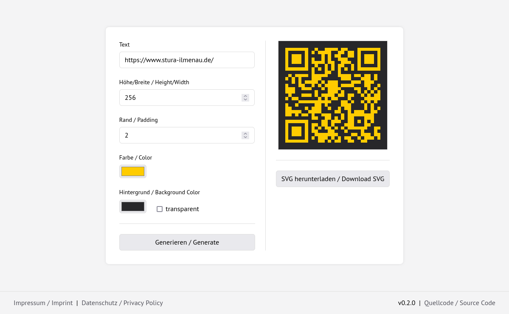

# QR Code Generator

A QR Code generator for self-hosting. Uses [qrcode-svg](https://github.com/papnkukn/qrcode-svg). Originally based on [https://github.com/datalog/qrcode-svg](https://github.com/datalog/qrcode-svg).




## Setup

```bash
npm install
npm run build
```

`npm install` fetches the dependencies (qrcode-svg, Bootstrap, Adwaita Sans font, [Lucide](https://lucide.dev) icons). `npm run build` copies the app and only the needed assets into `dist/`. Serve `dist/` as the web root.
